# 5-Day-Weather-Forecast-Application

## Project
This project tested out our ability to use server APIs and access their data and functionality by making requests with specific parameters to a URL. I was tasked with building a weather dashboard that will run in the browser and feature dynamically updated HTML and CSS.

## User Story
AS A traveller.
I WANT to see the weather outlook for multiple cities.
SO THAT I can plan a trip accordingly.

## Acceptance Criteria
The acceptance criteria for this project included:

1. Create a weather dashboard with form inputs.
2. When a user searches for a city they are presented with current and future conditions for that city and that city is added to the search history.
3. When a user views the current weather conditions for that city they are presented with:
 - The city name.
 - The date.
 - An icon representation of weather conditions.
 - The temperature.
 - The humidity.
 - The wind speed.
4. When a user views future weather conditions for that city they are presented with a 5-Day forecast that displays:
 - The date.
 - An icon representation of weather conditions.
 - The temperature.
 - The humidity.
5. When a user clicks on a city in the search history they are again presented with current and future conditions for that city.

## Outcome
This project was certainly challenging, in the sense with requesting weather information of a location, you initially have to make an API Call to get the longitude and latitude of a location and then pass that through another API Call to then get the weather information of the respective location. Though it was challenging, I was able to achieve the acceptance criteria.

1. A weather dashboard with form inputs was created.
2. When the user searches for a city, they are presented both with current conditions and future conditions and lastly, the name of that city is saved and added to the search history.
3. The current weather conditions are presented with:
 - A city name.
 - The date.
 - An icon representation of weather conditions.
 - The temperature.
 - The humidity.
 - The wind speed.
4. The future weather conditions for the city searched is presented in a 5-Day forecast that displays:
 - The date.
 - An icon representation of weathe conditions.
 - The temperature.
 - The humidity.
5. Lastly when the user clicks a city in the search history they are presented with the current and future weather conditions again.

## Screenshots
1. The browser showing the weather dashboard without any information.
 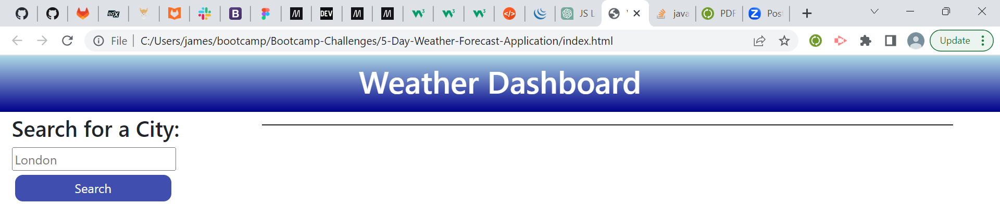

2. The code in HTML showing the weather dashboard.
 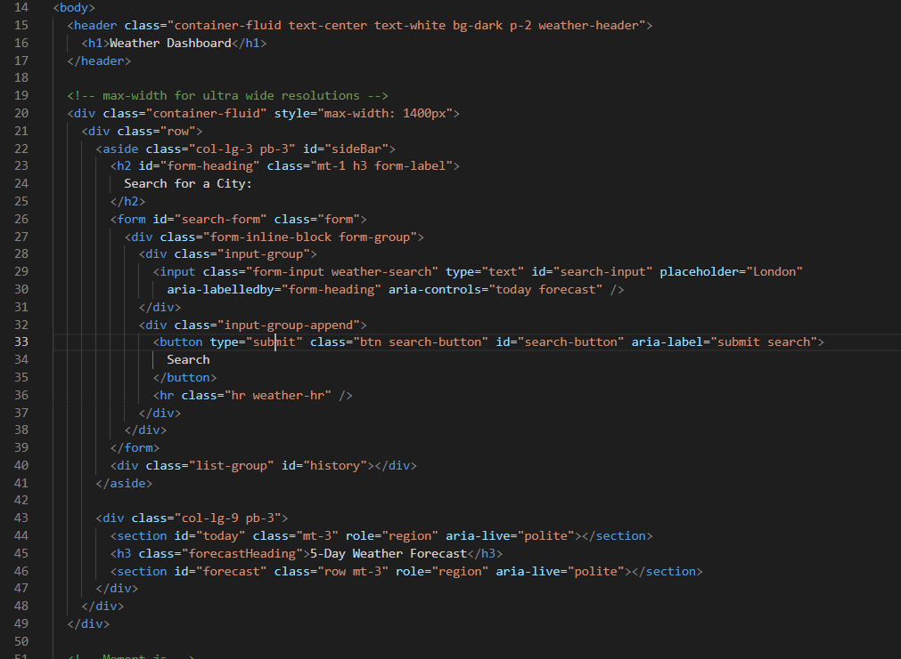

3. The current and future conditions being displayed in the browser when the user searches for a city.
 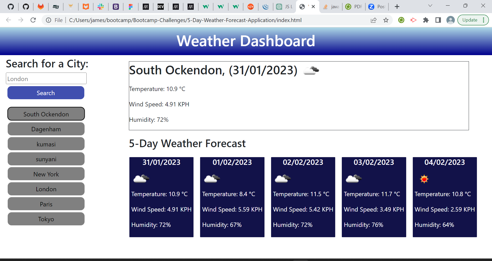

4. The code for the current and future conditions.
 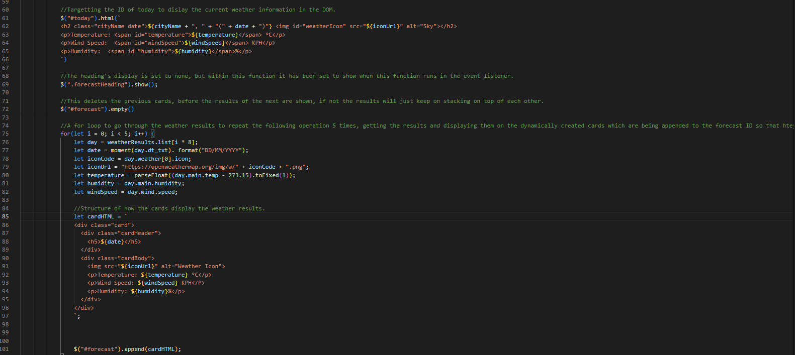

5. API Call to get the longitude and latitude and then another API Call to get the weather details of location using the results of the API Call for longitude and latitude.
 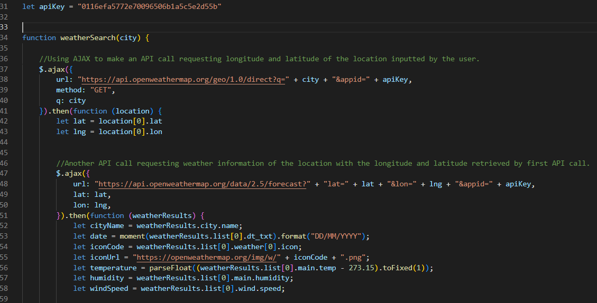

6. Current conditions displayed in the browser with the specified information asked for.
 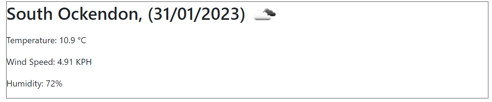

7. The code for how the current conditions are displayed.
 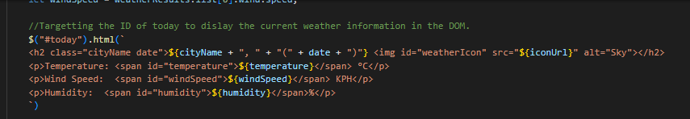

8. Future conditions displayed in the browser.
 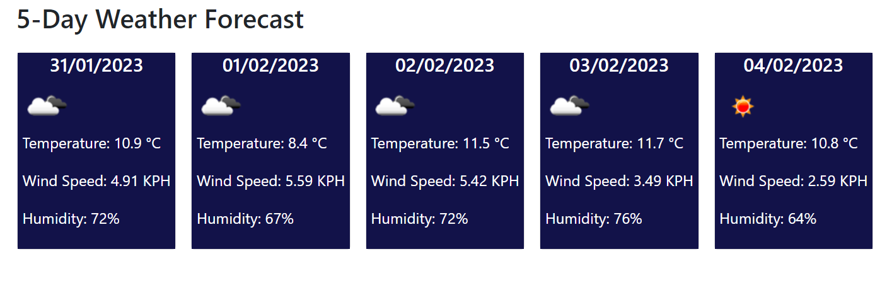

9. Code for future conditions.
 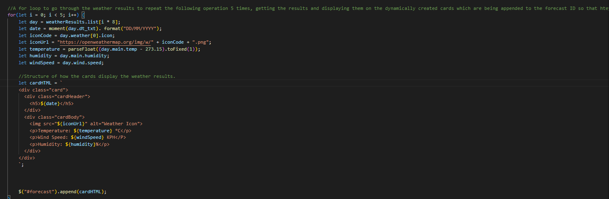

10. Search history results of Dagenham. Dagenham was searched previously and now is saved as a button in the search history.
 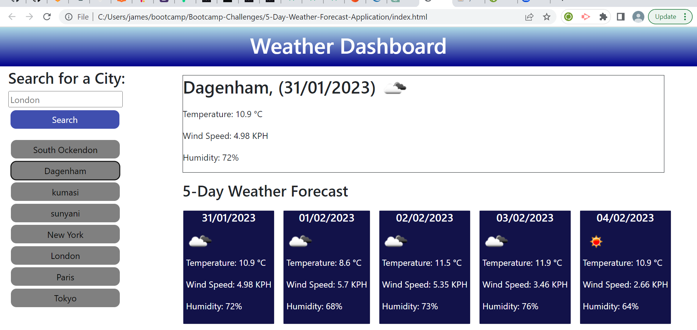

11. Here is the code for how the button are created and then saved to local storage and then retrieved.
 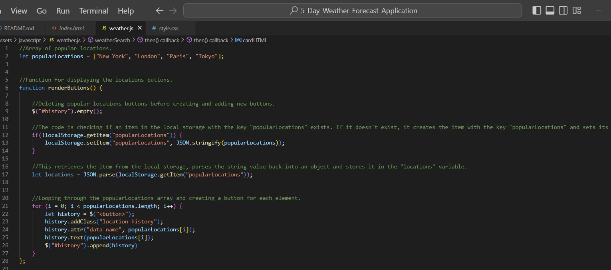

## License
MIT License

Copyright (c) 2022 JayClay922

Permission is hereby granted, free of charge, to any person obtaining a copy of this software and associated documentation files (the "Software"), to deal in the Software without restriction, including without limitation the rights to use, copy, modify, merge, publish, distribute, sublicense, and/or sell copies of the Software, and to permit persons to whom the Software is furnished to do so, subject to the following conditions:

The above copyright notice and this permission notice shall be included in all copies or substantial portions of the Software.

THE SOFTWARE IS PROVIDED "AS IS", WITHOUT WARRANTY OF ANY KIND, EXPRESS OR IMPLIED, INCLUDING BUT NOT LIMITED TO THE WARRANTIES OF MERCHANTABILITY, FITNESS FOR A PARTICULAR PURPOSE AND NONINFRINGEMENT. IN NO EVENT SHALL THE AUTHORS OR COPYRIGHT HOLDERS BE LIABLE FOR ANY CLAIM, DAMAGES OR OTHER LIABILITY, WHETHER IN AN ACTION OF CONTRACT, TORT OR OTHERWISE, ARISING FROM, OUT OF OR IN CONNECTION WITH THE SOFTWARE OR THE USE OR OTHER DEALINGS IN THE SOFTWARE.

## Deployed Web Application
The URL of the deployed web application is:
https://jayclay922.github.io/5-Day-Weather-Forecast-Application/